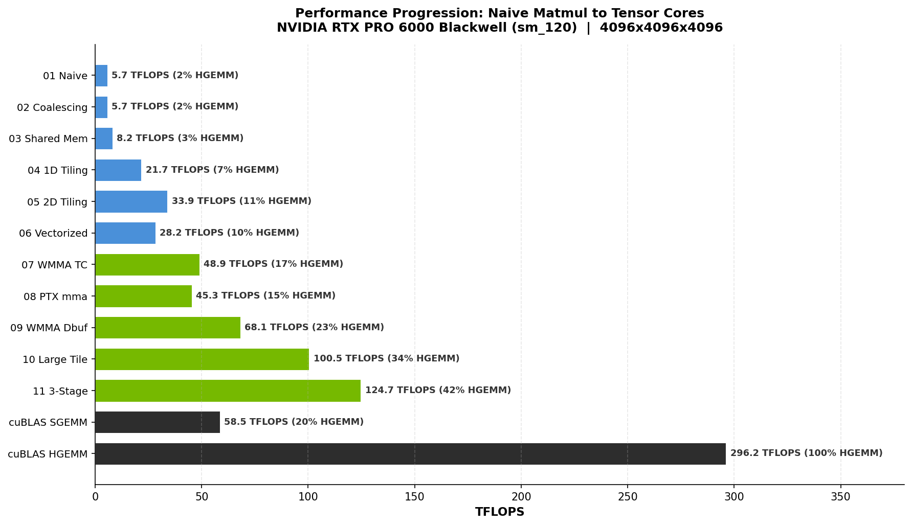

# tensor-core-from-scratch

**100 TFLOPS from hand-written CUDA. 34% of cuBLAS HGEMM. 10 self-contained files. No frameworks.**

A step-by-step progression from a naive matmul to optimized tensor cores on NVIDIA Blackwell, with every kernel benchmarked against cuBLAS and verified for correctness. ~2,500 lines of CUDA total. Read the code top-to-bottom — that's the whole point.



## Why this exists

[Simon Boehm's CUDA matmul guide](https://siboehm.com/articles/22/CUDA-MMM) is the gold standard for CUDA-core optimization — but it stops before tensor cores. [LeetCUDA](https://github.com/xlite-dev/LeetCUDA) has 200+ kernels but reads like a reference library, not a tutorial. This project fills the gap: a progressive, numbered sequence where each kernel introduces **exactly one new concept** and you can see the TFLOPS jump in real time.

## Performance Progression

Measured on **NVIDIA RTX PRO 6000 Blackwell** (sm_120, 188 SMs) with CUDA 12.8.
Problem size: 4096x4096x4096 matmul (137.4 GFLOP).

```
Kernel                    TFLOPS   % HGEMM   What You Learn
---------------------------------------------------------------
01 Naive                    5.67      1.9%    Baseline: 1 thread = 1 output element
02 Memory Coalescing        5.67      1.9%    Thread-to-memory mapping (concept)
03 Shared Memory Tiling     8.15      2.8%    SMEM as a software-managed cache
04 1D Block Tiling         21.68      7.3%    More work per thread
05 2D Block Tiling         33.92     11.5%    Register tiling (the big leap)
06 Vectorized Memory       28.22      9.5%    float4 loads — and why they can hurt
07 WMMA Tensor Cores       48.92     16.6%    First tensor core kernel (WMMA API)
08 PTX mma.sync            45.29     15.3%    Raw PTX: full register control
09 WMMA Double-Buffered    68.09     23.0%    Hide memory latency behind compute
10 Large Tiles + Dbuf     100.47     34.0%    BK=32 + double-buffer + 2x2 warp tiles
---------------------------------------------------------------
   cuBLAS SGEMM (FP32)    58.55     19.8%    (CUDA core reference)
   cuBLAS HGEMM (FP16)   295.65    100.0%    (tensor core reference)
```

Kernel 06 is intentionally slower than 05. Kernel 10 beats cuBLAS SGEMM by 1.7x because tensor cores have higher FP16 throughput than CUDA cores have FP32 throughput. The real target is cuBLAS HGEMM — we reach 34% of it, with the remaining gap due to techniques like cp.async, warp specialization, and memory swizzling.

## Quick Start

```bash
git clone https://github.com/waynehacking8/tensor-core-from-scratch.git
cd tensor-core-from-scratch

make ARCH=sm_120      # or sm_90 (Hopper), sm_89 (Ada Lovelace)
make run K=10_mma_async_pipeline
```

You should see something like:

```
=== Kernel 10: Large Tiles + Double-Buffered WMMA ===

GPU: NVIDIA RTX PRO 6000 Blackwell Max-Q Workstation Edition (SM 12.0)
Double-buffer SMEM: 37888 bytes

Problem size: M=4096, N=4096, K=4096
FLOPs per matmul: 137.44 GFLOP
Block tile: BM=128, BN=128, BK=32 (2x WMMA_K steps per load)

cuBLAS SGEMM (FP32):         2.35 ms    58.60 TFLOPS
cuBLAS HGEMM (FP16):         0.46 ms   295.65 TFLOPS
10_large_tile:               1.37 ms   100.47 TFLOPS  (171.4% of SGEMM,  34.0% of HGEMM)

  10_large_tile vs cuBLAS FP32   max=0.0527 avg=0.024089 [PASS]
```

Every kernel verifies element-wise against cuBLAS and prints `[PASS]` or `[FAIL]`. On your GPU, TFLOPS will scale proportionally to your hardware's peak throughput.

Requirements: CUDA Toolkit 12.8+ and an NVIDIA GPU with compute capability 7.0+ (Volta or later for tensor cores).

## What Each Kernel Teaches

### CUDA Core Fundamentals (01-06)

| # | File | Key Concept |
|---|------|-------------|
| 01 | `01_naive.cu` | Baseline matmul. One thread computes one output element. The simplest possible GPU kernel. |
| 02 | `02_global_memory_coalescing.cu` | Thread-to-memory mapping. On Blackwell's large L2, the effect is subtle — but the principle matters in every kernel that follows. |
| 03 | `03_shared_memory_tiling.cu` | Load a tile from DRAM into shared memory once, reuse it BLOCKSIZE times. The fundamental GPU optimization. |
| 04 | `04_1d_blocktiling.cu` | Each thread computes TM=8 elements instead of 1. Arithmetic intensity goes up, memory traffic stays flat. |
| 05 | `05_2d_blocktiling.cu` | Register tiling: each thread computes a TM x TN sub-tile via outer products. This is what gets you past 50% of cuBLAS SGEMM. |
| 06 | `06_vectorized_memory.cu` | `float4` loads and bank-conflict padding. Can *regress* vs kernel 05 due to register pressure — an honest lesson in GPU optimization. |

### Tensor Core Kernels (07-10)

| # | File | Key Concept |
|---|------|-------------|
| 07 | `07_wmma_tensor_cores.cu` | Your first tensor core kernel. WMMA C++ API, 16x16x16 fragments, FP16 compute with FP32 accumulation. One warp instruction = 8192 FLOPs. |
| 08 | `08_mma_ptx.cu` | Drop to inline PTX assembly. `mma.sync.aligned.m16n8k8` with manual fragment loading. Full control over register layout. |
| 09 | `09_wmma_double_buffered.cu` | Double-buffered shared memory: prefetch tile K+1 while computing on tile K. Hides global memory latency behind tensor core compute. |
| 10 | `10_mma_async_pipeline.cu` | BK=32 (2x K-steps per load) + double-buffer + 2x2 WMMA tiles per warp = 100 TFLOPS. The highest-performing kernel in this project. |

## How to Read This Project

Start with `01_naive.cu` and read sequentially. Each step introduces one concept:

1. **01 -> 02**: Same algorithm, different thread mapping -> coalescing concept
2. **02 -> 03**: Add shared memory -> tiling
3. **03 -> 04**: More work per thread (1D) -> arithmetic intensity
4. **04 -> 05**: 2D register tile -> outer-product formulation
5. **05 -> 06**: Wider loads -> why "faster" loads can slow you down
6. **06 -> 07**: CUDA cores to tensor cores -> WMMA (huge jump)
7. **07 -> 08**: WMMA to raw PTX -> register layout exposed
8. **08 -> 09**: Single-buffer to double-buffer -> latency hiding
9. **09 -> 10**: Larger K-tiles -> more compute per memory load

## Where the remaining 66% is hiding

Our best kernel reaches 34% of cuBLAS HGEMM. The gap comes from:

- **cp.async**: true asynchronous global→shared copies that bypass registers
- **Warp specialization**: separate warps for data movement vs compute
- **Memory swizzling**: conflict-free shared memory access patterns
- **Larger warp tiles**: each warp computing 64x64 or larger output tiles
- **Software pipelining**: multi-stage async pipelines with barrier synchronization
- **Tuned occupancy**: careful register/SMEM tradeoff per SM

These are the techniques used by CUTLASS and cuBLAS. Each could be a future kernel.

## Related projects

- **[inference-kernel-cookbook](https://github.com/waynehacking8/inference-kernel-cookbook)** — Flash Attention, KV Cache, Paged Attention: the inference techniques built on top of the matmul kernel you learned here.
- **[trtllm-triton-serving](https://github.com/waynehacking8/trtllm-triton-serving)** — What happens when you put these kernels into a production serving stack: TensorRT-LLM vs vLLM head-to-head on H100.
- **[nccl-collectives-bench](https://github.com/waynehacking8/nccl-collectives-bench)** — The multi-GPU communication layer underneath: NCCL benchmarks on 8×H100 NVSwitch.

## Acknowledgments

Inspired by [Andrej Karpathy](https://github.com/karpathy)'s "from scratch" philosophy (micrograd, nanoGPT, llm.c) and [Simon Boehm](https://siboehm.com/articles/22/CUDA-MMM)'s CUDA matmul optimization guide. This project starts where Boehm's ends — at tensor cores.

## License

MIT
